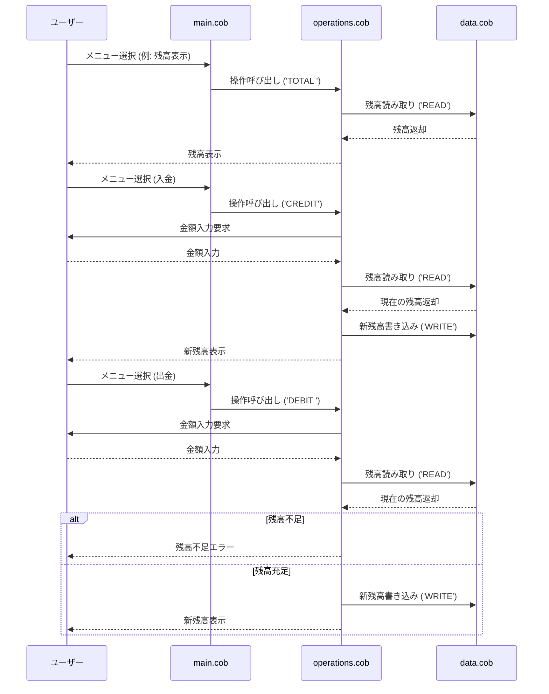

# COBOL 学生アカウント管理システム

このプロジェクトには、学生アカウントを管理するためのレガシーCOBOLベースのシステムが含まれています。このシステムは、残高の表示、入金、出金の基本的な銀行業務を提供します。

## COBOL ファイルの概要

### data.cob
**目的**: アカウント残高のデータ永続化と取得を処理します。

**主要機能**:
- 作業ストレージに現在のアカウント残高を保存（$1000.00で初期化）
- 残高データの読み取り/書き込み操作を提供
- アカウント管理システムのシンプルなデータ層として機能

**パラメータ**:
- `PASSED-OPERATION`: 操作タイプ ('READ' または 'WRITE')
- `BALANCE`: 読み取り/書き込み操作の残高値

### main.cob
**目的**: アカウント管理システムのメインエントリポイントとユーザーインターフェース。

**主要機能**:
- アカウント操作のためのインタラクティブなメニューを表示
- ユーザー入力と選択の検証を処理
- ユーザーの選択に基づいて適切な操作を呼び出し
- プログラムのフローと終了条件を管理

**メニューオプション**:
1. 残高を表示
2. アカウントに入金
3. アカウントから出金
4. 終了

### operations.cob
**目的**: アカウント操作のビジネスロジックを実装します。

**主要機能**:
- **残高を表示**: 現在のアカウント残高を取得して表示
- **アカウントに入金**: 指定された金額をアカウント残高に加算
- **アカウントから出金**: 指定された金額をアカウント残高から減算（検証付き）

**パラメータ**:
- `PASSED-OPERATION`: 操作タイプ ('TOTAL ', 'CREDIT', または 'DEBIT ')

## 学生アカウントのビジネスルール

### アカウント初期化
- すべての学生アカウントは$1000.00の初期残高で開始されます

### 残高操作
- **残高を表示**: 学生はいつでも現在のアカウント残高を表示できます
- **アカウントに入金**: 学生は制限なくアカウントに資金を追加できます
- **アカウントから出金**: 学生は十分な残高がある場合のみ資金を引き出せます

### 出金制限
- **残高不足チェック**: 出金はアカウント残高が出金額以上である場合のみ許可されます
- **オーバードラフトなし**: システムは負の残高を許可しません
- **エラーハンドリング**: 出金が利用可能な資金を超える場合、「残高不足」のメッセージでトランザクションが拒否されます

### データ永続化
- 残高の変更はデータ層を通じて即座に永続化されます
- すべての操作はリアルタイムで保存された残高を更新します

## システムアーキテクチャ

このシステムは、3つの主要コンポーネントで構成されるモジュラー設計に従っています：
1. **メインプログラム** (`main.cob`): ユーザーインターフェースとプログラム制御
2. **操作モジュール** (`operations.cob`): ビジネスロジックとトランザクション処理
3. **データモジュール** (`data.cob`): データストレージと取得

この分離により、メンテナンス可能なコードと明確な懸念の分離が可能になります。

## システムのシーケンス図

以下のシーケンス図は、アプリのデータフローを示しています。ユーザーが操作を選択し、各コンポーネントが連携して処理を行う流れを表しています。

